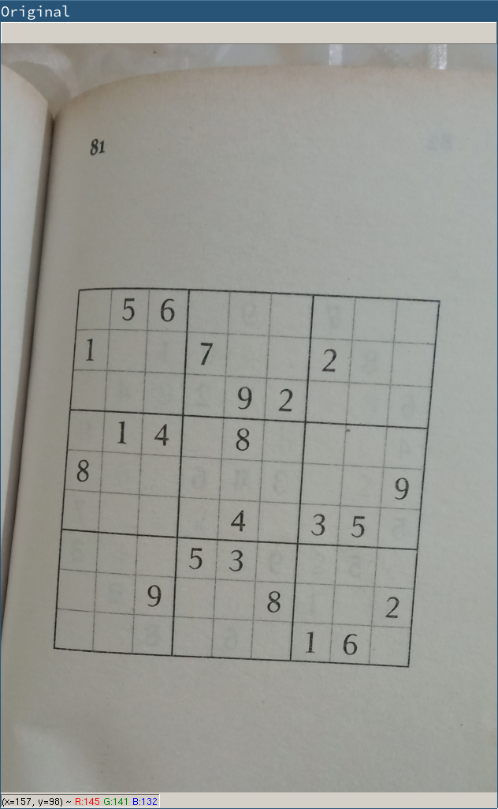
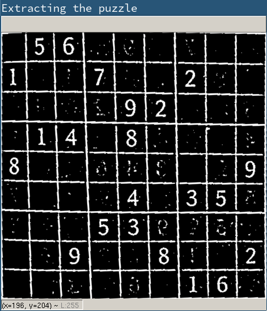
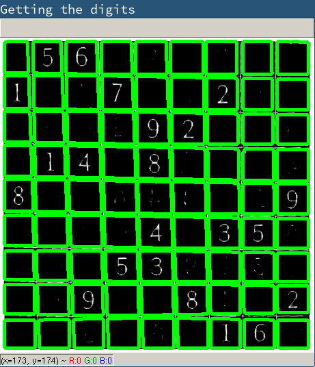
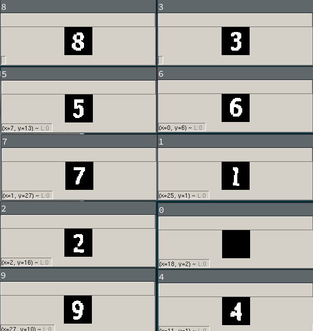
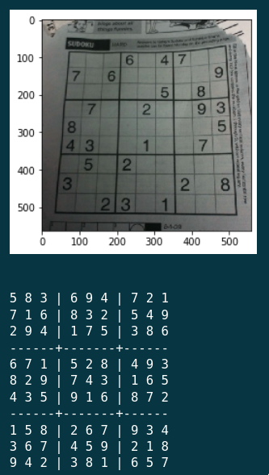

# ViSudoku

This is a visual sudoku solver. It takes a picture of a sudoku puzzle as input and then solves and prints the solution.

The whole opencv workflow is explained in `visudoku.ipynb`.
Training data (570 images) was generated by hand.

Digit recognition is done using K-Nearest Neighbours (knn).

The final puzzle is solved by a cpp program (here as a submodule) which I wrote a few years ago.

## Screenshots

A different example

