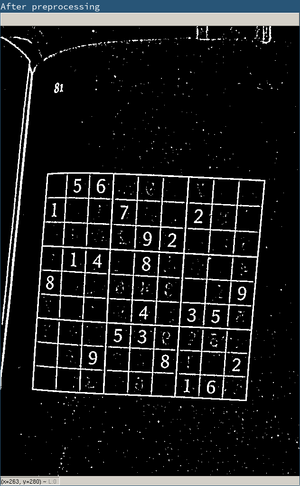

# ViSudoku

This is a visual sudoku solver. It takes a picture of a sudoku puzzle as input and then solves and prints the solution.

The whole opencv workflow is explained in `visudoku.ipynb`.

Training data (570 images) was generated by hand. Then, it was augmented in the following ways:
 - added black border of {1..4}px around the image to simulate smaller digits
 - removed black border of {1..4}px from the image to simulate larger digits
 - rotated {4, 8, 12, 16} degrees clockwise and anticlockwise to simulate weird orientations

Digit recognition is done using K-Nearest Neighbours (knn).

The final puzzle is solved by a cpp program (here as a submodule) which I wrote a few years ago.

## Screenshots

### An example

## Instructions

Run jupyterlab or jupyter notebook and run `visudoku.ipynb`.

You can either use the images given in `test-images`, or provide your own images, or even use the webcam.
To use the webcam, you can leave the `IMG_PATH` empty.

If you use the webcam, you have to press `c` when you want to capture the image.

After getting the image, it will automatically solve and give the solution at the bottom.

## Aside
This project began a year ago, I could only work on it in my vacations.

#### winter'18
 - Decided that I wanted to make something like this
 - Finished the opencv part (everything till digit extraction)
 - Got stuck at digit recognition.

#### summer'18
 - Took [a course on ml](https://www.coursera.org/learn/machine-learning)
 - Tried to make it recognize the digits, failed terribly
 - Realised that digit extraction is really bad, rewrote it
 - Wrote a [solarized-dark theme usercss](https://github.com/YoogottamK/jupyter-notebook-solarized-dark) for jupyter notebook and jupyterlab

#### winter'19
 - Tried digit recognition again, using a CNN, accuracy: 9%
 - Tried digit recognition using knn, accuracy: 99.69%
 - Put up all the pieces together

##### TODO: organize this in a better manner
